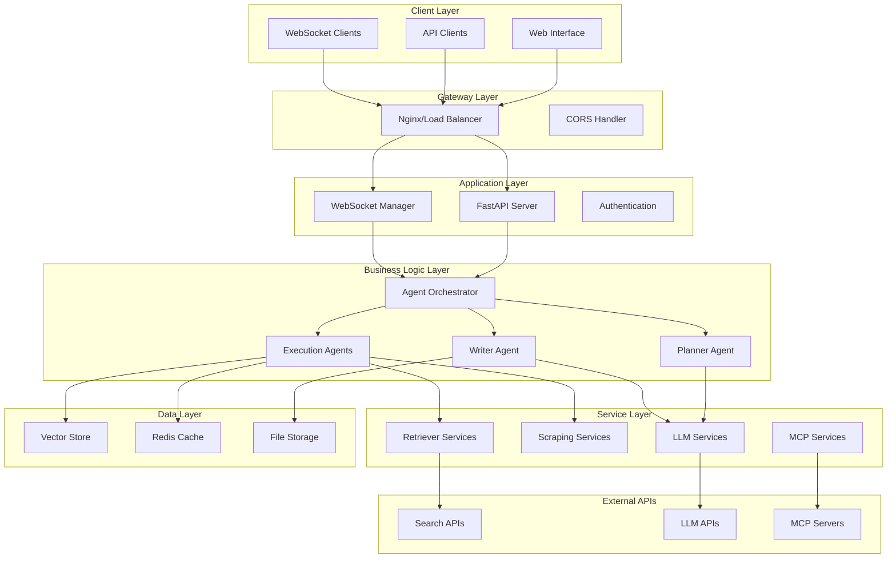
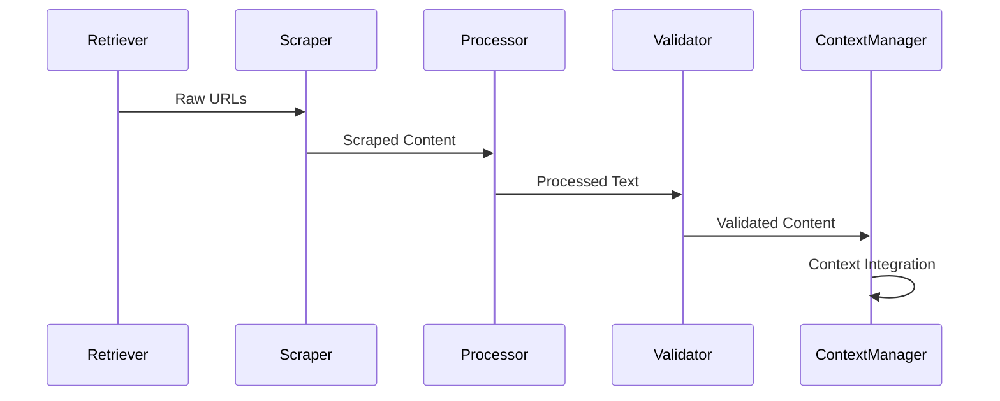
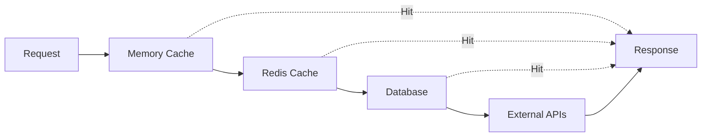

# 🏗️ GPT Researcher - Technical Architecture

## System Architecture Overview

GPT Researcher follows a multi-layered, microservices-oriented architecture designed for scalability, maintainability, and extensibility.

## 1. High-Level Architecture



## 2. Component Architecture

### 2.1 Core Components

#### Agent Orchestrator
```python
class AgentOrchestrator:
    """Central coordinator for all agent activities"""
    
    components:
        - PlannerAgent: Research planning and strategy
        - ExecutionAgents: Parallel information gathering
        - WriterAgent: Report generation and formatting
        - ContextManager: State and memory management
        - ProgressTracker: Real-time progress monitoring
    
    responsibilities:
        - Coordinate agent interactions
        - Manage execution flow
        - Handle error recovery
        - Monitor performance metrics
```

#### Planner Agent
```python
class PlannerAgent:
    """Strategic research planning agent"""
    
    capabilities:
        - Query intent analysis
        - Research question generation
        - Source selection strategy
        - Resource allocation planning
    
    llm_integration:
        - Model: Smart LLM (GPT-4, Claude, etc.)
        - Context: 4000+ tokens
        - Temperature: 0.4 (balanced creativity/accuracy)
```

#### Execution Agents
```python
class ExecutionAgent:
    """Parallel information gathering agents"""
    
    pool_configuration:
        - Max concurrent: 15 agents
        - Load balancing: Round-robin
        - Failure handling: Continue with available
    
    capabilities:
        - Multi-source search execution
        - Content scraping and extraction
        - Quality assessment and filtering
        - Parallel processing optimization
```

### 2.2 Service Layer Components

#### Retriever System
```python
class RetrieverSystem:
    """Unified interface for multiple search engines"""
    
    supported_retrievers:
        - TavilySearch: Primary web search
        - DuckDuckGoSearch: Privacy-focused search
        - GoogleSearch: Google Custom Search API
        - BingSearch: Microsoft Bing API
        - SerpAPISearch: Universal search API
        - SerperSearch: Real-time search API
        - SearxSearch: Self-hosted search
        - ArxivSearch: Academic papers
        - ExaSearch: AI-optimized search
        - MCPRetriever: Custom data sources
    
    features:
        - Automatic failover
        - Rate limiting compliance
        - Result aggregation
        - Quality scoring
```

#### LLM Provider System
```python
class LLMProviderSystem:
    """Multi-provider LLM integration"""
    
    supported_providers:
        - OpenAI: GPT-4, GPT-3.5, GPT-5 (when available)
        - Anthropic: Claude 3.5 Sonnet, Claude 3 Haiku
        - Azure OpenAI: Enterprise-grade OpenAI
        - Google: Gemini Pro, Gemini Flash
        - Groq: High-speed inference
        - OpenRouter: Multi-model routing
        - Together AI: Open-source models
        - Fireworks AI: Fast inference
        - Ollama: Local model deployment
        - And 15+ additional providers
    
    features:
        - Automatic model selection
        - Cost optimization
        - Rate limiting
        - Fallback mechanisms
        - Token management
```

### 2.3 Data Processing Pipeline

#### Content Processing Flow


#### Scraping Engine Architecture
```python
class ScrapingEngine:
    """Multi-engine content extraction system"""
    
    scrapers:
        - BeautifulSoupScraper: Standard HTML parsing
        - BrowserScraper: JavaScript-enabled scraping
        - TavilyExtractScraper: AI-optimized extraction
        - FirecrawlScraper: Advanced web scraping
        - PyMuPDFScraper: PDF document processing
        - ArxivScraper: Academic paper extraction
    
    features:
        - User-agent rotation
        - Proxy support
        - Rate limiting
        - Content validation
        - Image extraction
        - Text cleaning
```

## 3. Data Architecture

### 3.1 Data Models

#### Research Context Model
```python
@dataclass
class ResearchContext:
    query: str
    intent: ResearchIntent
    sources: List[Source]
    content: List[ContentChunk]
    citations: List[Citation]
    metadata: ContextMetadata
    
class ContentChunk:
    text: str
    source_url: str
    relevance_score: float
    quality_score: float
    timestamp: datetime
    
class Citation:
    source_id: str
    title: str
    url: str
    author: str
    publication_date: datetime
    excerpt: str
```

#### Configuration Model
```python
class Configuration:
    # LLM Configuration
    fast_llm: LLMConfig
    smart_llm: LLMConfig
    strategic_llm: LLMConfig
    
    # Retriever Configuration
    retrievers: List[str]
    max_search_results: int
    
    # Processing Configuration
    max_workers: int
    timeout_settings: TimeoutConfig
    
    # Output Configuration
    report_format: str
    total_words: int
    language: str
```

### 3.2 Vector Storage Architecture

#### Embedding System
```python
class EmbeddingSystem:
    """Vector storage and similarity search"""
    
    components:
        - EmbeddingProvider: Text-to-vector conversion
        - VectorStore: FAISS-based storage
        - SimilaritySearch: Semantic search capabilities
    
    supported_embedding_providers:
        - OpenAI: text-embedding-3-large/small
        - Azure OpenAI: Enterprise embeddings
        - Cohere: Multilingual embeddings
        - Google: Universal sentence encoder
        - HuggingFace: Open-source models
        - Ollama: Local embeddings
    
    features:
        - Semantic similarity search
        - Content deduplication
        - Context-aware retrieval
        - Multi-language support
```

## 4. Integration Architecture

### 4.1 API Integration Patterns

#### RESTful API Design
```yaml
API Endpoints:
  /research:
    POST: Create new research task
    GET: Retrieve research status
  
  /report/{research_id}:
    GET: Download completed report
  
  /config:
    POST: Update configuration
    GET: Retrieve current config
  
  /health:
    GET: System health check
  
  /metrics:
    GET: Performance metrics
```

#### WebSocket Integration
```python
class WebSocketManager:
    """Real-time communication management"""
    
    message_types:
        - status: Research progress updates
        - logs: Detailed logging information
        - error: Error notifications
        - result: Final research results
        - metrics: Performance metrics
    
    features:
        - Connection pooling
        - Message queuing
        - Automatic reconnection
        - Progress streaming
```

### 4.2 MCP (Model Context Protocol) Integration

#### MCP Architecture
```python
class MCPIntegration:
    """Model Context Protocol implementation"""
    
    components:
        - MCPClient: Protocol client implementation
        - ToolSelector: Intelligent tool selection
        - MCPStreaming: Real-time data streaming
    
    supported_servers:
        - GitHub MCP: Repository analysis
        - Database MCP: Direct database queries
        - File System MCP: Local file access
        - Custom APIs: Domain-specific integrations
    
    features:
        - Automatic server discovery
        - Tool capability negotiation
        - Secure communication
        - Context preservation
```

## 5. Security Architecture

### 5.1 Authentication & Authorization

#### API Security
```python
class SecurityManager:
    """Centralized security management"""
    
    features:
        - API key authentication
        - Rate limiting per client
        - Request validation
        - Input sanitization
        - Output filtering
    
    components:
        - AuthenticationProvider
        - RateLimiter
        - InputValidator
        - SecurityLogger
```

### 5.2 Data Protection

#### Privacy & Compliance
```yaml
Data Protection:
  - No persistent storage of research content
  - API key encryption at rest
  - Secure transmission (TLS 1.3)
  - Request logging with PII removal
  - GDPR compliance features
  
Security Controls:
  - Input validation and sanitization
  - Output content filtering
  - Rate limiting and throttling
  - Error handling without information leakage
  - Audit logging for compliance
```

## 6. Performance Architecture

### 6.1 Scalability Design

#### Horizontal Scaling
```python
class ScalingManager:
    """Auto-scaling and load management"""
    
    strategies:
        - Agent pool scaling based on load
        - Retriever instance multiplication
        - LLM request batching
        - Cache optimization
    
    metrics:
        - Request queue depth
        - Response time percentiles
        - Resource utilization
        - Error rates
```

### 6.2 Caching Strategy

#### Multi-Level Caching


## 7. Monitoring Architecture

### 7.1 Observability Stack

#### Monitoring Components
```python
class MonitoringSystem:
    """Comprehensive system monitoring"""
    
    components:
        - MetricsCollector: Performance metrics
        - LogAggregator: Centralized logging
        - AlertManager: Error notifications
        - HealthChecker: Service health monitoring
    
    metrics:
        - Request latency
        - Success/failure rates
        - Resource utilization
        - Cost tracking
        - Quality scores
```

### 7.2 Logging Architecture

#### Structured Logging
```json
{
  "timestamp": "2025-01-06T10:30:00Z",
  "level": "INFO",
  "component": "ExecutionAgent",
  "research_id": "task_1704537000_sample",
  "message": "Content retrieved successfully",
  "metadata": {
    "source_url": "https://example.com",
    "content_length": 2048,
    "processing_time": 1.23
  }
}
```

## 8. Deployment Architecture

### 8.1 Container Architecture

#### Docker Configuration
```yaml
Services:
  gpt-researcher:
    image: gptresearcher/gpt-researcher
    environment:
      - OPENAI_API_KEY
      - TAVILY_API_KEY
      - GROQ_API_KEY
      - OPENROUTER_API_KEY
    volumes:
      - ./my-docs:/app/my-docs
      - ./outputs:/app/outputs
    ports:
      - "8000:8000"
  
  gptr-nextjs:
    image: gptresearcher/gptr-nextjs
    environment:
      - NEXT_PUBLIC_GPTR_API_URL
    ports:
      - "3000:3000"
```

### 8.2 Kubernetes Deployment

#### Production Deployment
```yaml
apiVersion: apps/v1
kind: Deployment
metadata:
  name: gpt-researcher
spec:
  replicas: 3
  selector:
    matchLabels:
      app: gpt-researcher
  template:
    metadata:
      labels:
        app: gpt-researcher
    spec:
      containers:
      - name: gpt-researcher
        image: gptresearcher/gpt-researcher:latest
        resources:
          requests:
            memory: "1Gi"
            cpu: "500m"
          limits:
            memory: "2Gi"
            cpu: "1000m"
```

## 9. Technology Stack Details

### 9.1 Backend Technologies

```yaml
Core Framework:
  - FastAPI: Modern, fast web framework
  - Uvicorn: ASGI server
  - Pydantic: Data validation
  
AI/ML Stack:
  - LangChain: LLM orchestration
  - OpenAI SDK: Primary LLM provider
  - Multiple LLM adapters: Provider flexibility
  
Data Processing:
  - BeautifulSoup4: HTML parsing
  - aiohttp: Async HTTP client
  - PyMuPDF: PDF processing
  - Pandas: Data manipulation
  
Storage:
  - FAISS: Vector similarity search
  - Redis: Caching (optional)
  - SQLAlchemy: Database ORM
```

### 9.2 Frontend Technologies

```yaml
Lightweight Frontend:
  - HTML5/CSS3/JavaScript
  - Bootstrap: Responsive design
  - WebSocket: Real-time updates
  
Production Frontend:
  - Next.js: React framework
  - TypeScript: Type safety
  - Tailwind CSS: Utility-first CSS
  - React Hooks: State management
```

## 10. Future Architecture Considerations

### 10.1 Planned Enhancements

```yaml
Scalability Improvements:
  - Kubernetes native deployment
  - Microservices decomposition
  - Event-driven architecture
  - GraphQL API layer
  
AI/ML Enhancements:
  - Custom model fine-tuning
  - Federated learning capabilities
  - Advanced RAG implementations
  - Multi-modal processing
  
Integration Expansions:
  - Enterprise SSO integration
  - Advanced MCP server support
  - Real-time collaboration features
  - Mobile application support
```

---

**Document Version**: 1.0  
**Last Updated**: 2025-01-06  
**Architecture Review Date**: 2025-04-06