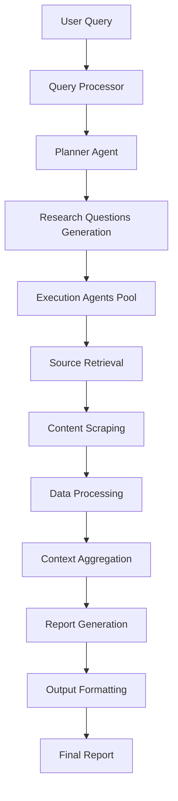

# 🔄 GPT Researcher - Workflow Documentation

## Complete System Workflow

This document provides a comprehensive overview of the GPT Researcher workflow, from query initialization to final report generation.

## 1. System Architecture Flow



## 2. Detailed Workflow Steps

### Phase 1: Query Processing & Planning

#### 1.1 Query Initialization
```
INPUT: User research query
PROCESS: 
  - Query validation and sanitization
  - Intent analysis and classification
  - Context extraction and preparation
OUTPUT: Structured query object
```

#### 1.2 Research Planning
```
AGENT: Planner Agent
PROCESS:
  - Generate research questions
  - Identify required sources
  - Plan execution strategy
  - Allocate resources
OUTPUT: Research plan with sub-questions
```

### Phase 2: Information Gathering

#### 2.1 Source Selection
```
COMPONENTS: Retriever System
PROCESS:
  - Select appropriate search engines
  - Configure search parameters
  - Initialize concurrent workers
  - Set rate limiting and quotas
OUTPUT: Configured retriever instances
```

#### 2.2 Parallel Execution
```
AGENTS: Execution Agents (up to 15 concurrent)
PROCESS:
  - Execute search queries
  - Retrieve raw content
  - Apply content filters
  - Handle rate limiting
OUTPUT: Raw source materials
```

### Phase 3: Content Processing

#### 3.1 Content Scraping
```
SCRAPERS: BeautifulSoup, Browser, Tavily Extract
PROCESS:
  - Extract text content
  - Process images and media
  - Clean and normalize data
  - Handle JavaScript rendering
OUTPUT: Structured content objects
```

#### 3.2 Content Analysis
```
ANALYZER: LLM-powered analysis
PROCESS:
  - Relevance scoring
  - Content summarization
  - Key information extraction
  - Citation preparation
OUTPUT: Analyzed content chunks
```

### Phase 4: Report Generation

#### 4.1 Content Aggregation
```
AGGREGATOR: Context Manager
PROCESS:
  - Combine relevant sources
  - Resolve conflicts and contradictions
  - Maintain citation tracking
  - Apply quality filters
OUTPUT: Aggregated research context
```

#### 4.2 Report Writing
```
WRITER: Writer Agent (LLM-powered)
PROCESS:
  - Generate structured outline
  - Write comprehensive content
  - Insert citations and references
  - Apply formatting and style
OUTPUT: Complete research report
```

### Phase 5: Output & Delivery

#### 5.1 Format Conversion
```
FORMATTERS: Multiple format handlers
PROCESS:
  - Markdown to HTML conversion
  - PDF generation
  - Word document creation
  - JSON structured output
OUTPUT: Multi-format reports
```

## 3. Agent Interaction Patterns

### 3.1 Planner Agent Workflow
```python
class PlannerAgent:
    def plan_research(self, query):
        # Step 1: Analyze query intent
        intent = self.analyze_intent(query)
        
        # Step 2: Generate research questions
        questions = self.generate_questions(query, intent)
        
        # Step 3: Prioritize and organize
        plan = self.organize_research_plan(questions)
        
        return plan
```

### 3.2 Execution Agent Workflow
```python
class ExecutionAgent:
    async def execute_research(self, question, sources):
        # Step 1: Select retriever
        retriever = self.select_retriever(sources)
        
        # Step 2: Perform search
        results = await retriever.search(question)
        
        # Step 3: Scrape content
        content = await self.scrape_content(results)
        
        # Step 4: Process and filter
        processed = self.process_content(content)
        
        return processed
```

### 3.3 Writer Agent Workflow
```python
class WriterAgent:
    async def write_report(self, context, requirements):
        # Step 1: Create outline
        outline = await self.create_outline(context)
        
        # Step 2: Write sections
        sections = await self.write_sections(outline, context)
        
        # Step 3: Compile report
        report = self.compile_report(sections)
        
        # Step 4: Review and refine
        final_report = await self.review_report(report)
        
        return final_report
```

## 4. Data Flow Architecture

### 4.1 Request Flow
```
Client Request → FastAPI Router → WebSocket Manager → Agent Orchestrator
                                                    ↓
Report Response ← Format Converter ← Writer Agent ← Execution Pool
```

### 4.2 Data Processing Pipeline
```
Raw Query → Query Processor → Research Planner → Question Generator
                                                        ↓
Search Results ← Source Retrievers ← Execution Agents ← Question Pool
        ↓
Content Scraper → Content Processor → Context Manager → Report Writer
                                                        ↓
Final Report ← Format Converter ← Quality Checker ← Report Generator
```

## 5. Configuration Workflows

### 5.1 LLM Provider Selection
```yaml
llm_selection_flow:
  - validate_api_keys
  - check_model_availability
  - configure_rate_limits
  - initialize_providers
  - fallback_configuration
```

### 5.2 Retriever Configuration
```yaml
retriever_setup:
  - parse_retriever_string
  - validate_retrievers
  - configure_api_connections
  - set_search_parameters
  - initialize_workers
```

## 6. Error Handling Workflows

### 6.1 API Failure Handling
```python
async def handle_api_failure(provider, error):
    # Step 1: Log error
    logger.error(f"API failure: {provider} - {error}")
    
    # Step 2: Check retry policy
    if should_retry(error):
        await asyncio.sleep(get_backoff_time())
        return await retry_request()
    
    # Step 3: Fallback to alternative
    alternative = get_fallback_provider(provider)
    return await use_alternative(alternative)
```

### 6.2 Content Processing Errors
```python
def handle_content_error(url, error):
    # Step 1: Log and categorize error
    error_type = categorize_error(error)
    
    # Step 2: Apply recovery strategy
    if error_type == "timeout":
        return retry_with_longer_timeout(url)
    elif error_type == "blocked":
        return use_alternative_scraper(url)
    
    # Step 3: Skip if unrecoverable
    return mark_as_failed(url)
```

## 7. Performance Optimization Workflows

### 7.1 Concurrent Processing
```python
async def optimize_concurrent_processing():
    # Determine optimal worker count
    max_workers = min(15, get_available_resources())
    
    # Create task pool
    semaphore = asyncio.Semaphore(max_workers)
    
    # Execute with resource management
    tasks = [process_with_semaphore(task, semaphore) 
             for task in research_tasks]
    
    return await asyncio.gather(*tasks)
```

### 7.2 Caching Strategy
```python
class CacheManager:
    def get_cached_result(self, query_hash):
        # Check memory cache
        if query_hash in self.memory_cache:
            return self.memory_cache[query_hash]
        
        # Check persistent cache
        return self.persistent_cache.get(query_hash)
    
    def cache_result(self, query_hash, result):
        # Store in both caches
        self.memory_cache[query_hash] = result
        self.persistent_cache.set(query_hash, result)
```

## 8. Quality Assurance Workflows

### 8.1 Content Validation
```python
def validate_content_quality(content):
    checks = [
        validate_relevance(content),
        check_source_credibility(content),
        verify_citation_accuracy(content),
        assess_information_freshness(content)
    ]
    return all(checks)
```

### 8.2 Report Quality Control
```python
async def quality_control_report(report):
    # Step 1: Structure validation
    structure_score = validate_report_structure(report)
    
    # Step 2: Content quality assessment
    content_score = await assess_content_quality(report)
    
    # Step 3: Citation verification
    citation_score = verify_citations(report)
    
    # Step 4: Overall quality rating
    overall_score = calculate_quality_score(
        structure_score, content_score, citation_score
    )
    
    return overall_score > QUALITY_THRESHOLD
```

## 9. Monitoring & Logging Workflows

### 9.1 Performance Monitoring
```python
class PerformanceMonitor:
    def track_operation(self, operation_name):
        start_time = time.time()
        
        def finish():
            duration = time.time() - start_time
            self.metrics.record(operation_name, duration)
            
        return finish
```

### 9.2 Error Tracking
```python
def track_error(error, context):
    error_data = {
        'timestamp': datetime.utcnow(),
        'error_type': type(error).__name__,
        'message': str(error),
        'context': context,
        'stack_trace': traceback.format_exc()
    }
    
    logger.error(json.dumps(error_data))
    metrics.increment('errors', tags={'type': error_data['error_type']})
```

## 10. Integration Workflows

### 10.1 MCP Integration Flow
```python
async def integrate_mcp_server(config):
    # Step 1: Initialize MCP client
    client = MCPClient(config)
    
    # Step 2: Connect to server
    await client.connect()
    
    # Step 3: Discover tools
    tools = await client.list_tools()
    
    # Step 4: Register tools
    for tool in tools:
        register_tool(tool.name, tool)
    
    return client
```

### 10.2 WebSocket Communication Flow
```python
async def handle_websocket_research(websocket, query):
    # Step 1: Send initial status
    await websocket.send_json({"type": "status", "message": "Starting research"})
    
    # Step 2: Stream progress updates
    async def progress_callback(step, progress):
        await websocket.send_json({
            "type": "progress", 
            "step": step, 
            "progress": progress
        })
    
    # Step 3: Execute research with streaming
    result = await execute_research(query, progress_callback)
    
    # Step 4: Send final result
    await websocket.send_json({"type": "result", "data": result})
```

---

**Document Version**: 1.0  
**Last Updated**: 2025-01-06  
**Dependencies**: System Architecture, API Specification