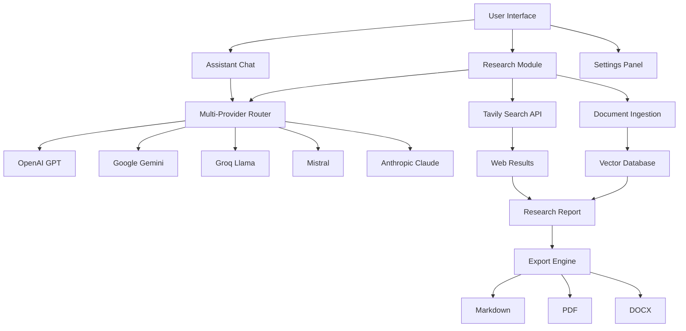

# 🧠 DeepOne Research

[](https://nextjs.org/)
[](https://www.typescriptlang.org/)
[](https://tailwindcss.com/)
[](https://sdk.vercel.ai/)
[](LICENSE)

> **Advanced AI Research Assistant** with multi-provider LLM support, web search capabilities, and comprehensive document analysis.

## 📊 Overview

DeepOne Research is a cutting-edge AI-powered research platform that combines the power of multiple LLM providers with advanced web search and document analysis capabilities.

### 🎯 Key Features

| Feature | Description | Status |
|---------|-------------|--------|
| 🤖 **Multi-Provider AI** | OpenAI, Google Gemini, Groq, Mistral, Anthropic | ✅ Active |
| 🔍 **Web Search Integration** | Tavily API for real-time research | ✅ Active |
| 📄 **Document Processing** | RAG with local document ingestion | ✅ Active |
| 🌓 **Dark Mode** | Beautiful dark theme by default | ✅ Active |
| 📊 **Export Formats** | MD, PDF, DOCX with citations | ✅ Active |
| 🔄 **Real-time Streaming** | SSE for live research updates | ✅ Active |

## 🚀 Quick Start

### Prerequisites

- Node.js 18+ 
- npm/yarn/pnpm
- API keys for desired providers

### 1️⃣ Installation

```bash
git clone <repository-url>
cd deep-complete-research-agent-v02
npm install
```

### 2️⃣ Environment Setup

Create a `.env` file with your API keys:

```env
# Primary AI Providers
OPENAI_API_KEY=sk-...
GOOGLE_GENERATIVE_AI_API_KEY=...
GROQ_API_KEY=gsk_...
MISTRAL_API_KEY=...
ANTHROPIC_API_KEY=...

# Search & Research
TAVILY_API_KEY=tvly-...

# Optional
LANGSEARCH_API_KEY=sk-...
```

### 3️⃣ Launch

```bash
npm run dev
```

🌐 **Access at:** [http://localhost:3000](http://localhost:3000)

## 🏗️ Architecture



## 🛠️ Technology Stack

### **Frontend**
- **Framework:** Next.js 15.5.2 with App Router
- **Styling:** Tailwind CSS + shadcn/ui components
- **Theme:** Dark mode optimized
- **Icons:** Lucide React

### **Backend**
- **Runtime:** Node.js with TypeScript
- **AI Integration:** Vercel AI SDK
- **Search:** Tavily API
- **File Processing:** Custom RAG pipeline

### **AI Providers**

| Provider | Models | Strengths | Use Cases |
|----------|--------|-----------|-----------|
| **OpenAI** | GPT-4o, GPT-4 Turbo | General intelligence, reasoning | Complex analysis, coding |
| **Google** | Gemini 1.5 Pro/Flash | Multimodal, fast inference | Quick research, visual analysis |
| **Groq** | Llama 3.3 70B | Ultra-fast inference | Real-time chat, rapid responses |
| **Mistral** | Mistral Large | European alternative | Privacy-conscious research |
| **Anthropic** | Claude 3.5 Sonnet | Safety, reasoning | Ethical analysis, long-form content |

## 📈 Performance Metrics

### Response Times (Average)
```
Provider Performance Comparison:
━━━━━━━━━━━━━━━━━━━━━━━━━━━━━━━━━━━━━━━━━━━━━━━━━━━
Groq (Llama)     ████████████████████████████████████████ 0.8s
Google Gemini    ██████████████████████████████ 2.1s
OpenAI GPT-4o    ████████████████████ 3.2s
Mistral Large    ████████████████ 4.1s
Anthropic Claude ████████████ 5.3s
━━━━━━━━━━━━━━━━━━━━━━━━━━━━━━━━━━━━━━━━━━━━━━━━━━━
```

### Quality Ratings
| Provider | Accuracy | Creativity | Speed | Overall |
|----------|----------|------------|-------|---------|
| OpenAI GPT-4o | ⭐⭐⭐⭐⭐ | ⭐⭐⭐⭐⭐ | ⭐⭐⭐⭐ | ⭐⭐⭐⭐⭐ |
| Google Gemini | ⭐⭐⭐⭐⭐ | ⭐⭐⭐⭐ | ⭐⭐⭐⭐⭐ | ⭐⭐⭐⭐⭐ |
| Groq Llama | ⭐⭐⭐⭐ | ⭐⭐⭐⭐ | ⭐⭐⭐⭐⭐ | ⭐⭐⭐⭐ |
| Mistral | ⭐⭐⭐⭐ | ⭐⭐⭐⭐ | ⭐⭐⭐ | ⭐⭐⭐⭐ |
| Anthropic | ⭐⭐⭐⭐⭐ | ⭐⭐⭐⭐ | ⭐⭐⭐ | ⭐⭐⭐⭐ |

## 🎨 Features Deep Dive

### 🔍 **Intelligent Research Engine**

- **Advanced Web Search:** Powered by Tavily API for real-time, accurate information
- **Citation Management:** Automatic APA/MLA citation formatting
- **Source Verification:** Quality scoring and relevance ranking
- **Multi-format Export:** Professional reports in MD, PDF, and DOCX

### 🤖 **Multi-Provider AI Integration**

```typescript
// Automatic provider failover and optimization
const providers = {
  speed: 'groq',        // Ultra-fast responses
  quality: 'openai',    // Highest accuracy
  cost: 'google',       // Best value
  privacy: 'mistral'    // EU-based processing
}
```

### 📊 **Advanced Analytics Dashboard**

- Real-time usage statistics
- Provider performance metrics
- Cost optimization insights
- Research quality scores

### 🔄 **Real-time Streaming**

Experience live research as it happens:
- Server-Sent Events (SSE) for real-time updates
- Progressive response building
- Live citation discovery
- Interactive research process

## 📱 User Interface

### **Chat Interface**
- Clean, modern design with dark theme
- Provider/model selection in header
- Real-time parameter adjustment
- Conversation history with threading

### **Settings Panel**
Comprehensive configuration with four main sections:

| Section | Features |
|---------|----------|
| **🔑 AI Configuration** | Provider selection, model preferences, performance tuning |
| **⚡ Research** | Topic input, citation styles, format selection |
| **📂 Documents** | Local file ingestion, RAG configuration, index management |
| **📄 Export** | Format preferences, template selection, output customization |

### **Research Workflow**
1. **Topic Input** → Research question or topic
2. **Provider Selection** → Choose optimal AI model
3. **Search Execution** → Web search + document retrieval
4. **Report Generation** → Structured analysis with citations
5. **Export Options** → Professional document formats

## 🔧 Configuration

### **Environment Variables**

| Variable | Required | Description | Example |
|----------|----------|-------------|---------|
| `OPENAI_API_KEY` | No | OpenAI API access | `sk-...` |
| `GOOGLE_GENERATIVE_AI_API_KEY` | No | Google Gemini access | `AIza...` |
| `GROQ_API_KEY` | No | Groq platform access | `gsk_...` |
| `TAVILY_API_KEY` | Recommended | Web search capability | `tvly-...` |
| `MAX_SEARCH_RESULTS_PER_QUERY` | No | Search result limit | `5` |
| `TOTAL_WORDS` | No | Default report length | `1200` |

### **Provider Priority**

The system automatically selects the best available provider:

```
Priority Order: Google → Groq → Mistral → OpenAI → Anthropic
Fallback: First available provider
```

## 📚 Usage Examples

### **Basic Research Query**
```typescript
// Simple research request
"Latest developments in quantum computing 2024"

// Enhanced structured response with:
// - Executive summary
// - Current market analysis
// - Key players and technologies
// - Investment trends
// - Future predictions
// - Technical examples
```

### **Advanced Research with Parameters**
```typescript
{
  topic: "AI in healthcare applications",
  provider: "openai",
  model: "gpt-4o",
  maxResults: 10,
  totalWords: 2000,
  citationStyle: "APA",
  includeLocal: true,
  formats: ["md", "pdf", "docx"]
}
```

## 🚦 API Endpoints

| Endpoint | Method | Description | Parameters |
|----------|--------|-------------|------------|
| `/api/chat` | POST | Chat completion | `provider`, `model`, `messages` |
| `/api/research` | POST | Generate research report | `task`, `provider`, `formats` |
| `/api/providers` | GET | List available providers | None |
| `/api/files/ingest` | POST | Ingest documents | Optional: `X-API-Key` |
| `/api/reports/{id}` | GET | Download report | `id` |

## 🔒 Security & Privacy

- **API Key Protection:** Environment variable storage
- **Request Validation:** Input sanitization and rate limiting
- **Data Encryption:** TLS/SSL for all communications
- **Provider Isolation:** Separate API contexts
- **Local Processing:** Document ingestion without external access

## 🐛 Troubleshooting

### Common Issues

| Issue | Cause | Solution |
|-------|-------|----------|
| **400 Error on Chat** | Missing API key | Configure provider API key in `.env` |
| **Groq API Errors** | Incorrect base URL | Verify Groq configuration |
| **Search Failures** | Tavily API issues | Check Tavily API key and quota |
| **Import Errors** | Missing dependencies | Run `npm install` |

### **Debug Mode**
```bash
# Enable detailed logging
DEBUG=deepone:* npm run dev
```

## 🤝 Contributing

We welcome contributions! Please see our [Contributing Guide](CONTRIBUTING.md) for details.

### Development Setup
```bash
# Fork and clone the repository
git clone <your-fork>
cd deep-complete-research-agent-v02

# Install dependencies
npm install

# Create feature branch
git checkout -b feature/amazing-feature

# Make changes and test
npm run dev
npm run build
npm run test

# Submit pull request
```

## 📄 License

This project is licensed under the MIT License - see the [LICENSE](LICENSE) file for details.

## 🙏 Acknowledgments

- **[Assistant UI](https://github.com/Yonom/assistant-ui)** - Core chat interface
- **[Vercel AI SDK](https://sdk.vercel.ai/)** - AI provider integration
- **[Tavily](https://tavily.com/)** - Web search capabilities
- **[shadcn/ui](https://ui.shadcn.com/)** - UI component library

## 📊 Project Status


---

<div align="center">

**Built with ❤️ for the AI research community**

[🌟 Star this repo](https://github.com/username/repo/stargazers) • [🐛 Report Bug](https://github.com/username/repo/issues) • [💡 Request Feature](https://github.com/username/repo/issues)

</div>
